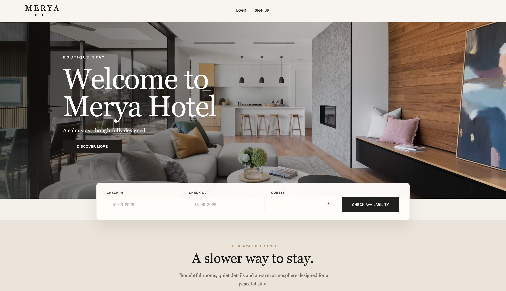
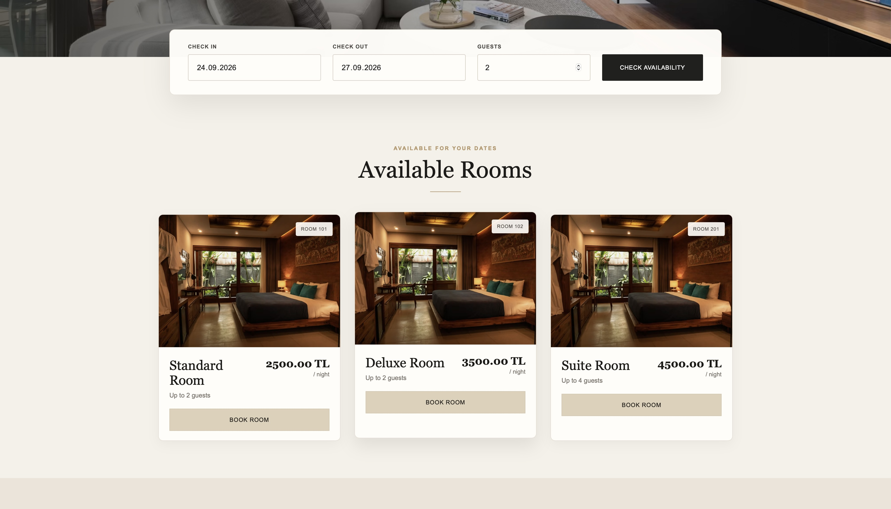
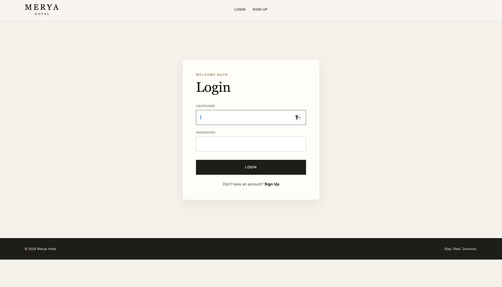
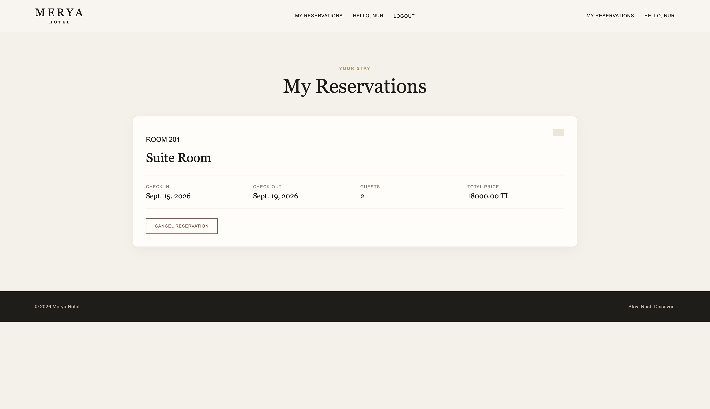

# Hotel Reservation System

A hotel reservation system developed with Django to practice backend development and reservation business logic.

## Project Purpose

The main purpose of this project was to understand how a reservation system handles date availability and prevents conflicting bookings.

The project also helped me practice working with Django models, forms, authentication, database relationships, and user-specific data.

## Features

- User registration and login
- Search rooms by check-in and check-out dates
- Filter rooms according to guest capacity
- Display only active and available rooms
- Prevent overlapping reservations
- Calculate total price based on number of nights
- Create reservations for authenticated users
- Display reservations belonging to the logged-in user
- Cancel reservations
- Track reservation status as upcoming, active, completed, or cancelled
- Validate check-in and check-out dates

## Technologies

- Python
- Django
- HTML
- CSS
- SQLite

## Backend Logic

One of the main focuses of this project is reservation conflict prevention.

A room is considered unavailable when an existing reservation overlaps with the requested date range.

The availability check uses the following logic:

- Existing check-in date is before the requested check-out date.
- Existing check-out date is after the requested check-in date.
- Cancelled reservations are excluded from the conflict check.

This prevents the same room from being reserved for overlapping dates.

## What I Practiced

Through this project, I practiced:

- Django models and database relationships
- Django Forms and form validation
- User authentication
- Querying and filtering data with Django ORM
- Working with ForeignKey relationships
- User-specific database queries
- Reservation business logic
- Date validation
- Basic CRUD operations
## Screenshots

### Home Page

### Room Availability

### User Login

### My Reservations
